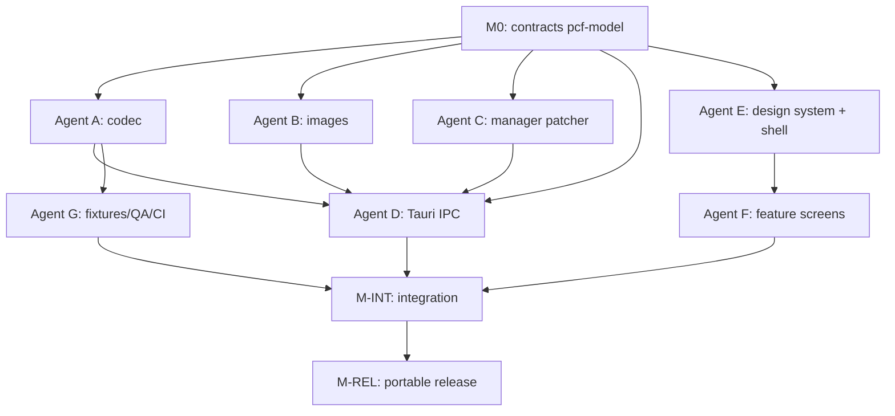

# Editor PC Fútbol 6.0 — Apertura 98/99 · Build Plan

> A modern, portable, retro-skinned database editor for **PC Apertura 98/99** (the Argentine edition of the PC Fútbol 6.0 engine).
> This document is written to be handed to **multiple build agents working in parallel**. Read "How to use this document" first.

---

## How to use this document

The work is split into **independent workstreams**, one per agent. Parallelism is safe because:

1. **Contracts are frozen first.** Milestone M0 defines the shared data model and the Tauri IPC surface. Every agent codes against those types, using mocks for anything another agent owns. Nobody waits on anybody for M0.
2. **Directory ownership is exclusive.** Each agent owns a disjoint set of paths (see the ownership table). No two agents write the same file, so merges don't conflict.
3. **The gate is the round-trip test**, not another agent's progress. An agent is "done" when its own acceptance tests pass against the golden fixtures.

Sequence: **M0 (contracts) → agents A–G run in parallel → M-INT (integration) → M-REL (release).**

---

## 1. Goal & non-negotiables

Build a desktop app that lets a **non-technical user** update the PC Apertura 98/99 database (teams, squads, coaches, tactics, crests, photos) through a GUI that looks and feels like the original game, then export files the game reads directly.

Hard requirements:

- **Portable.** Single executable, no installer, no runtime dependency to install. Target ~5–15 MB.
- **Byte-exact.** Generated DBC files must be loadable by the game and, for unedited records, byte-identical to the originals.
- **Simple.** A first-time user should be editing a player within a minute of opening the app.
- **Faithful skin.** Colors, typography, layout and animation evoke PC Fútbol 6.0, driven by real screenshots from the user's own copy.
- **Own-copy only.** The app edits the user's legally-owned files; it ships no proprietary Dinamic data. Pointer tables and the character map are treated as user-supplied/community reference data loaded at runtime, not bundled game content.

---

## 2. Tech stack (decided)

| Layer | Choice | Why |
|---|---|---|
| Shell | **Tauri 2.x** | Tiny portable single-exe, native file dialogs, web UI. |
| Data / binary | **Rust** | Precise byte control; the format has to round-trip exactly. |
| Binary parsing | **`binrw`** | Declare the byte layout once, get reader + writer that stay in sync. |
| Frontend | **Svelte + Vite + TypeScript** | Built-in transitions make the retro animations cheap; smaller bundle than React. |
| Error handling | `thiserror` (libraries), `anyhow` (bins) | Typed errors across the IPC boundary. |
| Serialization | `serde` + `serde_json` | The IPC contract between Rust and Svelte. |
| Images | `image` crate (+ manual palette handling) | 8-bit indexed BMP read/write. |

If a workstream hits a blocker in its chosen crate, it may swap the crate **without** changing the contracts in §4 — the contracts are the only cross-agent commitment.

---

## 3. Workspace layout & directory ownership

```
pcf-editor/
├── Cargo.toml                  # workspace manifest            [Agent G]
├── PLAN.md                     # this file
├── crates/
│   ├── pcf-model/              # shared types + serde          [Agent A owns, all read]
│   ├── pcf-codec/              # DBC parse/write, char map     [Agent A]
│   ├── pcf-images/             # 256-color BMP + palette       [Agent B]
│   └── pcf-manager/            # manager.exe patcher           [Agent C]
├── src-tauri/                  # Tauri commands (IPC)          [Agent D]
│   ├── Cargo.toml
│   ├── tauri.conf.json
│   └── src/
├── ui/
│   ├── src/
│   │   ├── lib/
│   │   │   ├── design/         # tokens, fonts, theme          [Agent E]
│   │   │   ├── components/     # beveled panels, tabs, bars     [Agent E]
│   │   │   ├── ipc.ts          # typed wrappers over invoke()   [Agent E]
│   │   │   └── mocks/          # fake data for offline UI dev    [Agent E]
│   │   └── routes/             # screens (team, squad, …)       [Agent F]
│   └── ...
├── fixtures/                   # golden DBCs + reference data    [Agent G]
│   ├── golden/                 # original DBCs from a real install
│   ├── charmap/                # byte↔char map (user-supplied)
│   └── pointers/               # Apertura team-pointer table
└── tests/                      # cross-crate integration         [Agent G]
```

**Rule:** an agent only writes inside the paths marked with its letter. Cross-cutting files (`Cargo.toml` workspace, CI) belong to Agent G; other agents request changes via an issue, they don't edit them.

---

## 4. Frozen contracts (Milestone M0 — do this before splitting off)

Everything below is the **only** thing agents share. Land it first, in `crates/pcf-model`, as the single source of truth. UI mirrors these as TypeScript types generated from the JSON (or hand-mirrored in `ui/src/lib/ipc.ts`).

### 4.1 Data model (Rust, `pcf-model`)

```rust
pub struct Dbc {
    pub header: DbcHeader,
    pub team: Team,
    pub tactics: Tactics,
    pub coach: Option<Coach>,   // None when the team is "foreign" (flag = 01)
    pub players: Vec<Player>,   // empty when foreign
}

pub struct DbcHeader {
    pub file_version: u16,      // the FE01-style marker; governs optional fields
    pub language: u8,           // 0 = Spanish (editor default)
    pub is_foreign: bool,       // false = national/playable, true = foreign league
}

pub struct Team {
    pub short_name: String,
    pub stadium_name: String,
    pub long_name: String,
    pub country: u8,            // country code
    pub capacity: u32,          // seated
    pub standing_capacity: u32, // may be absent in some file versions
    pub founded: u16,
    pub members: u32,
    pub president: String,
    pub budget: u32,            // in pesetas
    pub affiliate1: u16,        // 0xFFFF = none
    pub affiliate2: u16,        // 0xFFFF = none
    pub league_history: [LeagueResult; 10], // last 10 seasons
    pub stats: TeamStats,
    pub palmares: Vec<u8>,      // fixed-length blob; length is version-dependent
}

pub struct LeagueResult { pub position: u8, pub division: Division } // 00=1st 01=2nd 02=2ndB 03=3rd
pub struct TeamStats { pub played: u16, pub won: u16, pub drawn: u16,
                       pub gf: u16, pub ga: u16, pub points: u16,
                       pub champion: u8, pub runner_up: u8 }

pub struct Tactics {
    pub touch_pct: u8, pub counter_pct: u8,
    pub attack: AttackType,     // 0 offensive, 1 speculative, 2 mixed
    pub tackling: Tackling,     // 0 soft, 1 medium, 2 aggressive
    pub marking: Marking,       // 0 zonal, 1 man
    pub clearance: Clearance,   // 0 played, 1 long
    pub pressing: Pressing,     // 0 own-half, 1 medium, 2 rival-half
    pub formation_blob: Vec<u8>,// the long positional string, treated as opaque for v1
}

pub struct Coach {
    pub pointer: u16,
    pub short_name: String,
    pub long_name: String,
    // free-text fields default to "x"; career defaults to "ND,ND,ND,ND,ND=="
    pub profile: String, pub systems: String, pub palmares: String,
    pub anecdotes: String, pub last_season: String,
    pub career_coach: String,
    pub was_player: bool,       // the 0x03 separator
    pub career_player: String,
    pub declarations: String,
}

pub struct Player {
    pub pointer: u16,           // unique within the team
    pub number: u8,             // dorsal
    pub short_name: String,
    pub long_name: String,
    pub slot: u8,
    pub origin: u8,             // 0 = continues
    pub roles: [Role; 6],       // codes 0x00..=0x12
    pub nationality: u8,
    pub skin: Skin,             // 1 white, 2 black, 3 mixed
    pub hair: Hair,             // 1..=6
    pub demarcation: Demarcation, // 0 GK, 1 DEF, 2 MID, 3 FWD
    pub birth: Date,            // day, month, year(u16)
    pub height_cm: u8,
    pub weight_kg: u8,
    pub birth_country: u8,
    pub birthplace: String,
    // free-text fields default to "x"; career defaults to "ND,ND,ND,ND,ND=="
    pub attrs: Attributes,
}

/// Order on disk is EXACTLY this. Do not reorder.
pub struct Attributes {
    pub velocidad: u8, pub resistencia: u8, pub agresividad: u8,
    pub calidad: u8, pub remate: u8, pub regate: u8,
    pub pase: u8, pub tiro: u8, pub entradas: u8, pub portero: u8,
}

pub struct Date { pub day: u8, pub month: u8, pub year: u16 }
```

### 4.2 Pointer rules (shared, `pcf-model::pointers`)

- Team override file name: `EQ97` + 4-digit **decimal** team pointer, e.g. team pointer `9013` → `EQ979013.DBC`.
- Player pointer block: team *k* (1-indexed in load order) owns player pointers `(k-1)*50 + 1 ..= k*50` (50 per team). Barcelona → 1..50, second team → 51..100, etc.
- On open: look up the file's team pointer in the loaded PKF index to recover the correct player block. If not found, fall back to block `1..50` (mirrors the reference editor's behaviour — flag to the user).
- "Use file's own player pointers" mode: preserve the pointers already in the DBC instead of reassigning.

### 4.3 IPC surface (Tauri commands — the UI↔Rust seam)

All payloads are the serde-JSON of the §4.1 types. This list is the contract Agent D implements and Agents E/F consume (via mocks until D lands).

```
load_pkf(path: String)            -> TeamIndex          // [{pointer, short_name, country}]
open_dbc(path: String)            -> Dbc
save_dbc(dbc: Dbc, out_dir: String, mode: PointerMode) -> String  // returns filename written
new_dbc(template: Option<Dbc>)    -> Dbc
import_crest(img: String, team_pointer: u16, out_dir: String)  -> AssetResult
import_photo(img: String, player_pointer: u16, out_dir: String)-> AssetResult
export_dbdat(project: Project, game_dir: String) -> ExportReport
detect_game_dir()                 -> Option<String>
patch_manager(path: String, opts: ManagerPatch) -> PatchReport   // {y2k, start_year}
charmap_status()                  -> CharmapInfo       // loaded? missing glyphs?
```

`PointerMode = { Auto, PreserveFromFile }`. Errors cross the boundary as `{ code, message, context }` (typed via `thiserror` → serialized).

> **contract-change (post-M0):** added `load_pkf_team(path: String, pointer: u16) -> Dbc`.
> Once `load_pkf` is wired to the real `pcf_codec::container` parser (see
> `fixtures/PKF_FORMAT.md`), the natural next step — the user picks one team
> out of the loaded `TeamIndex` and edits it — needs a way to fetch that
> team's full `Dbc`, bridged from its `ContainerTeamRecord`
> (`pcf_codec::container_bridge::container_team_to_dbc`) rather than read
> from a standalone override file. `open_dbc` was deliberately left as-is
> (it documents opening an existing standalone `.DBC` override file by
> path, a different request shape) rather than repurposed, to avoid
> muddying its one existing meaning. Implemented in
> `src-tauri/src/commands.rs`, mirrored in `ui/src/lib/ipc.ts`'s
> `loadPkfTeam`. No `pcf-model`/`ui/src/lib/model.ts` type changes were
> needed — it reuses the existing `Dbc` shape verbatim.

**Definition of M0 done:** `pcf-model` compiles, publishes these types, ships `pointers` helpers with unit tests, and the TS mirror + mock fixtures exist in `ui/src/lib`. Tag `v0.0.1-contracts`.

---

## 5. Dependency graph



After M0, **A, B, C, D, E, G start immediately and in parallel.** F starts as soon as E's component skeletons exist (it can run on mocks before then). D can be built against mocked crate calls and swapped to the real crates as they land.

---

## 6. Agent briefs

Each brief: **Scope · Owns · Depends on · Deliverables · Acceptance.**

### Agent A — Codec (`crates/pcf-codec`, co-owns `pcf-model`)
- **Scope:** Parse and serialize DBC team + coach + player records; the custom character codec; little-endian numeric fields; length-prefixed strings; pointer assignment logic.
- **Owns:** `crates/pcf-codec/**`, `crates/pcf-model/**`.
- **Depends on:** M0, `fixtures/golden`, `fixtures/charmap`.
- **Deliverables:** `binrw` structs matching Appendix A; `CharMap::load()` + encode/decode; `Dbc::read(bytes)` / `Dbc::write() -> Vec<u8>`; pointer helpers; the "unknown glyph" error surfaced (not panicked).
- **Acceptance:**
  - **Round-trip gate:** for every file in `fixtures/golden`, `write(read(bytes)) == bytes` (byte-identical).
  - Editing a single field then writing changes only the expected bytes (diff test).
  - Decodes a known team (name, capacity, founded, budget) to the expected human values.
  - Missing/!ambiguous glyph returns a typed error naming the byte offset.

### Agent B — Images (`crates/pcf-images`)
- **Scope:** Read/write 8-bit indexed (256-color) BMP for crests (`MINIESC`, `NANOESC`) and photos (`MINIFOTOS`); palette extraction and **palette repair** (imported art must adopt a valid game palette); output filenames by pointer.
- **Owns:** `crates/pcf-images/**`.
- **Depends on:** M0 (pointer helpers).
- **Deliverables:** `import_crest(src) -> Bmp8` with palette-conform step; size/format validation; `filename_for(pointer, kind)`.
- **Acceptance:** a truecolor PNG imports to an 8-bit BMP that opens in the game without palette corruption; crest/photo dimensions match the game's expected sizes; round-trips an original crest byte-identically.

### Agent C — Manager patcher (`crates/pcf-manager`)
- **Scope:** Patch `manager.exe` for the **Apertura 98/99** edition (manager size ≈ 2397 KB): the Y2K fix and the season-start-year, each at edition-specific offsets, always writing a `.bak` first.
- **Owns:** `crates/pcf-manager/**`.
- **Depends on:** M0; Appendix B; an Apertura `manager.exe` in fixtures for offset confirmation.
- **Deliverables:** `patch_y2k()` (replace `6C070000760881FDD0070000` → `01000000760881FDFFFF0000`), `set_start_year()`, `verify()` (detects already-patched), automatic backup + restore.
- **Acceptance:** patch is idempotent; `verify()` correctly reports patched/unpatched; a mispatch is impossible on a non-Apertura binary (size/signature guard).

### Agent D — Tauri backend (`src-tauri`)
- **Scope:** Implement every command in §4.3 as a thin wrapper over A/B/C; native file/folder dialogs; game-folder detection; `export_dbdat` writes the `DBDAT\EQ003003\` tree.
- **Owns:** `src-tauri/**`.
- **Depends on:** M0 (can mock A/B/C, then swap to real).
- **Deliverables:** registered commands, error mapping to the `{code,message,context}` shape, `export_dbdat` producing a game-ready folder.
- **Acceptance:** each command round-trips its JSON contract in an integration test; export produces a folder the game loads; no business logic lives here (all in the crates).

### Agent E — Design system + shell (`ui/src/lib/**`)
- **Scope:** Svelte app skeleton; retro **design tokens** (palette, bitmap font, beveled surfaces) derived from reference screenshots; core components (BeveledPanel, TabBar, AttributeBar, StatField, Advisor); `ipc.ts` typed wrappers; `mocks/` fixtures.
- **Owns:** `ui/src/lib/**`, app entry/router shell.
- **Depends on:** M0.
- **Deliverables:** themeable component library rendering on mock data; tab navigation; the attribute-bar and player-card primitives from the approved mockup; transition helpers.
- **Acceptance:** Storybook-style demo route shows every component on mock data; app runs and navigates with **zero** backend (mocks only); passes the design checklist (see §8).

### Agent F — Feature screens (`ui/src/routes/**`)
- **Scope:** The actual editing screens — Team, Squad/Player (the hero screen), Coach & Tactics, Crests & Photos, Export — wired to `ipc.ts`.
- **Owns:** `ui/src/routes/**`.
- **Depends on:** E's components + M0; runs on mocks until D lands.
- **Deliverables:** full edit flows; client-side validation (pointer collisions, string length limits, palmarés fixed length); undo/redo + autosave; the "point me at your game folder" first-run flow.
- **Acceptance:** a user can open a DBC (mock then real), edit team + a player's 10 attributes, import a crest, and export — entirely via GUI; validation blocks the known corruption cases with friendly messages.

### Agent G — Fixtures, QA, CI, packaging (`fixtures/**`, `tests/**`, CI)
- **Scope:** Assemble golden fixtures from a real Apertura install; the round-trip harness; cross-crate integration tests; CI (fmt, clippy, test, round-trip); portable-build packaging and release.
- **Owns:** `fixtures/**`, `tests/**`, workspace `Cargo.toml`, CI config, `tauri.conf.json` bundle settings.
- **Depends on:** A (for the harness); a real install (user-provided).
- **Deliverables:** golden DBC set + charmap + Apertura pointer table; `cargo test` round-trip gate wired into CI; single-file portable build for Windows (and Linux for Wine users).
- **Acceptance:** CI is green on fmt/clippy/test/round-trip; a produced binary launches with no install and opens a real DBC.

---

## 7. Milestones & sequencing

| Milestone | Contents | Blocks |
|---|---|---|
| **M0** | Frozen contracts (`pcf-model`, IPC, TS mirror, mocks) | everything |
| **M1** (parallel) | A round-trips golden files · B imports one crest · C patches a manager · D commands on mocks · E component demo · F squad screen on mocks · G CI green | — |
| **M-INT** | Swap D onto real crates; F onto real IPC; end-to-end open→edit→export against a real install | M1 |
| **M-REL** | Portable single-exe, first-run flow, docs, signed/zipped release | M-INT |

Suggested branch/commit convention (so G's CI stays sane): `agent-a/feature-x`, conventional commits, PR into `main`, CI must pass the round-trip gate before merge.

---

## 8. Cross-agent conventions

- **Rust:** edition 2021, `rustfmt` default, `clippy` clean (deny warnings in CI), libraries return `Result<_, ThisError>`, no `unwrap()` in non-test code.
- **No cross-ownership writes.** Need a change in another agent's file? Open an issue; don't edit.
- **Contracts are law.** Changing a §4 type requires a version bump of `pcf-model` and a note in the PR title (`contract-change:`), so dependents re-sync.
- **Design checklist (E/F):** sentence-case labels; two font weights; retro palette from real screenshots; every animation ≤ 250 ms and skippable; readable at the app's smallest window size.
- **Endianness & strings (A/B):** multi-byte numbers are little-endian (bytes reversed); every string is a 2-byte LE length + custom-encoded bytes; never assume ASCII.
- **Safety:** the app writes only inside the user's chosen output/game folders and always backs up `manager.exe` before patching.

---

## 9. Risks & open questions

1. **Character map source.** The DBC text encoding is a custom substitution, not ASCII (see Appendix A example). The community ships a `map.txt`; we load it at runtime from `fixtures/charmap`. **Action (G):** obtain the Apertura-matching map; **A:** treat unknown glyphs as recoverable errors.
2. **Palmarés length.** The team-record breakdown shows a 34-char palmarés blob, while the competitions tab references 68 chars for editor-generated files. Treat length as **version-dependent**; **A** must confirm against a golden Apertura fixture, not hardcode.
3. **Version-variant fields.** Stadium latitude and standing-capacity bytes appear in some file versions and not others. **A** reads them when present, writes the editor-canonical form; gate on golden round-trip.
4. **Apertura-specific manager offsets.** Y2K bytes are known; calendar/competition offsets differ per edition. **C** confirms against a real 2397 KB Apertura `manager.exe` before enabling calendar editing (defer calendar to post-v1 if unconfirmed).
5. **Palette fidelity.** Imported art must adopt a working 256-color palette or the game shows garbage. **B** must conform to a known-good palette rather than emit arbitrary indexed BMPs.
6. **Pointer reshuffle on insert.** Inserting a player mid-list renumbers the block, which desyncs already-saved photos. **F** warns; recommend finishing squads before importing photos (mirrors reference-editor guidance).

---

## Appendix A — DBC format (verified, v6.0 engine)

Source of truth: carky12's `EditorPCFutbol6` documentation and the `pcx-utils` reverse-engineering work. Values are hex; multi-byte numbers are **little-endian (reverse the bytes)**; strings are **2-byte LE length + custom-encoded bytes** (not ASCII).

**File signature / fixed prelude**
- `Copyright (c) 1996 Dinamic Multimedia` — fixed ASCII banner (`436F70…6469 61`).
- `FE06` — fixed opening bytes.
- `FE01` — file-version marker (governs which optional fields exist).
- `00` — language (`00` = Spanish, editor default).
- `00` — league flag: `00` national/playable, `01` foreign (foreign ⇒ **no** coach/player data).

**Team record (in order)**
| Field | Bytes | Notes |
|---|---|---|
| Short name | len(2 LE) + chars | e.g. `1000` = 16 chars |
| Stadium name | len + chars | |
| Country code | 1 | |
| Long name | len + chars | |
| Seated capacity | 3 (LE) | `D85301` → `0153D8` = 87000 |
| separator | `00` | fixed |
| Standing capacity | 3 (LE) | may be absent in some versions |
| separator | `00` | fixed |
| Pitch size | `46006A00` | fixed, 70×106 |
| Founded | 2 (pair-reversed) | `6E07` → `076E` = 1902 |
| Members | 3 (LE) | `701101` → `011170` = 70000 |
| separator | `00` | fixed |
| President | len + chars | |
| Budget | 3 (LE) | pesetas; `504600` → `004650` |
| Affiliate ptr 1 | `FFFF` if none | |
| Affiliate ptr 2 | `FFFF` if none | |
| Last-10 league results | 40 chars | pairs POSITION-DIVISION; division `00`=1st `01`=2nd `02`=2ndB `03`=3rd |
| Played / Won / Drawn / GF / GA / Points | 2 each (LE) | |
| Champion count | 1 | |
| Runner-up count | 1 | |
| Jornada positions | 92 chars | editor always writes zeros |
| Palmarés | 34 chars* | *length version-dependent — verify against fixture |
| Formation blob | long fixed-ish string | opaque for v1 |

**Team tactics** (`46390001000001`)
- `46` touch % (70) · `39` counter % (57) · attack `00` off /`01` spec /`02` mixed · tackling `00` soft /`01` med /`02` aggr · marking `00` zonal /`01` man · clearance `00` played /`01` long · pressing `00` own /`01` med /`02` rival.

**Coach chain** — starts with fixed `02`, then: pointer(2) · short name(len+chars) · long name · profile · usual systems · palmarés · anecdotes · last season (each len+chars, default `"x"`) · coach career (default `"ND,ND,ND,ND,ND=="`) · `03` = "was also a player" separator · player career · declarations. If the byte after coach career ≠ `03`, skip straight to declarations.

**Player record (repeats; in order)**
| Field | Bytes | Notes |
|---|---|---|
| Start marker | `01` | fixed |
| Pointer | 2 (LE) | unique within team |
| Number (dorsal) | 1 | |
| Short name | len + chars | |
| Long name | len + chars | |
| Slot | 1 | |
| Origin | 1 | `00` = continues (editor default) |
| Roles | 6 | codes `00`..`12` (see role list below) |
| Nationality | 1 | country code |
| Skin | 1 | `01` white `02` black `03` mixed |
| Hair | 1 | `01` blond `02` bald `03` dark `04` white/grey `05` red `06` brown |
| Demarcation | 1 | `00` GK `01` DEF `02` MID `03` FWD |
| Birth date | 4 | day, month, year(2 LE) |
| Height | 1 | cm |
| Weight | 1 | kg |
| Birth country | 1 | |
| Birthplace | len + chars | |
| Debut club, international, profile, characteristics, palmarés, internationality, anecdotes, last season | len + chars each | editor default `"x"` |
| Career | len + chars | default `"ND,ND,ND,ND,ND=="` |
| **Attributes** | **10** | order: **VE, RE, AG, CA, RM, RG, PA, TI, EN, PO** |

Role codes: `00` empty · `01` GK · `02` RB · `03` LB · `04` sweeper · `05` LCB · `06` RCB · `07` RM · `08` RIM · `09` CF · `0A` deep playmaker · `0B` LM · `0C` RW · `0D` central AM · `0E` LW · `0F` DM · `10` right AM · `11` left AM · `12` LIM.

**Encoding example (proof it's not ASCII):** "Real Madrid C.F." encodes as `3304000D412C000513080541224F274F` — so `R=33 e=04 a=00 l=0D (space)=41 M=2C d=05 r=13 i=08 . =4F F=27`. A per-version substitution map is required to read/write text.

## Appendix B — Container, paths & manager patch (Apertura 98/99)

- **Teams container:** `EQ003003.PKF`.
- **Manager size (sanity guard):** ≈ **2397 KB**.
- **Override DBCs go in:** `DBDAT\EQ003003\`, filename `EQ97` + 4-digit decimal team pointer (Boca `9013` → `EQ979013.DBC`).
- **Asset folders (siblings under `DBDAT`):** `MINIESC`, `NANOESC` (crests), `MINIFOTOS` (photos) — 8-bit BMPs with a valid game palette.
- **Y2K fix:** replace `6C070000760881FDD0070000` → `01000000760881FDFFFF0000`.
- **Season start year & calendar/competitions:** fixed offsets, **edition-specific** — confirm against a real Apertura manager before enabling; defer calendar editing if unverified.

## Appendix C — Reference projects

- **carky12 / EditorPCFutbol6** — the reference editor; source of the byte-level spec above. Use as an implementation oracle and for the pointer table.
- **spisemisu / pcx-utils** (GitLab) — Haskell reverse-engineering toolset for PCF/PCB data; clean reference for parsing logic and the `manager.exe` Y2K fix.
- **pcfutbolmania.com** — active community: pointer tables, character maps, season updates.
